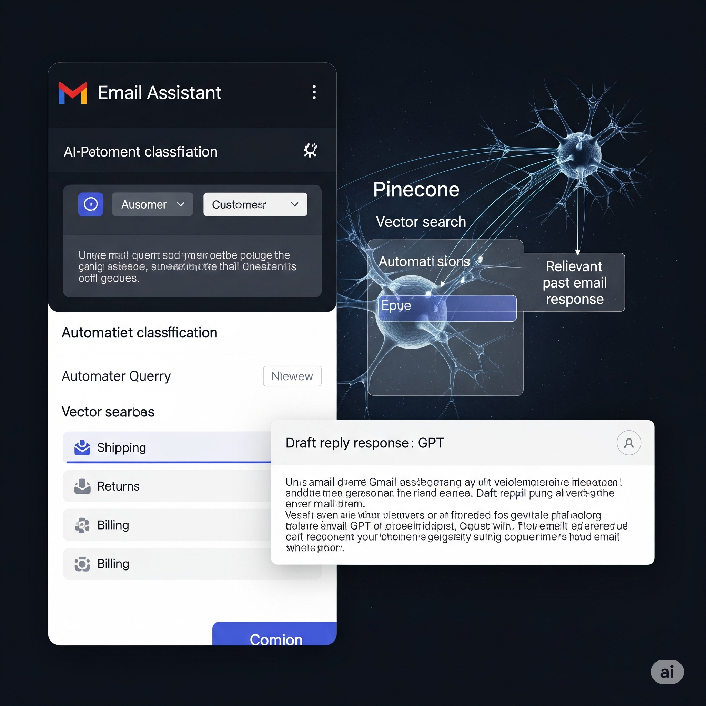

# 💼 Tyagesh Parmar – AI & Data Science Portfolio

Welcome to my personal portfolio website built to showcase my skills, projects, and certifications in Artificial Intelligence, Machine Learning, Data Science, and Automation using no-code tools like n8n.

🌐 **Live Portfolio**: [tyageshparmar.github.io](https://tyageshparmar.github.io/)

---

## 📌 About

This portfolio highlights my academic journey, AI certifications, and hands-on projects using modern tools and techniques such as:

- Machine Learning & Deep Learning
- Natural Language Processing (NLP)
- No-code automation (n8n)
- AI Chatbots & Image Generation
- Web Deployment (GitHub Pages)

---

## 🚀 Technologies Used

- **Frontend**: HTML, CSS, SCSS, JavaScript
- **Automation**: [n8n.io](https://n8n.io/)
- **AI APIs**: OpenAI, Pinecone, Tavily, Google APIs
- **Version Control & Hosting**: GitHub, GitHub Pages
- **Image & Icon Assets**: Freepik, Flaticon

---

## 🧠 Featured Projects

| Project | Description |
|--------|-------------|
| **Global Weather Trend Forecasting** | A multivariate LSTM model that predicts climate patterns and anomalies using Kaggle datasets. |
| **Customer Support Auto-Reply** | Smart email assistant that classifies and replies to customer queries using GPT & Pinecone. |
| **RAG AI Chatbot** | Retrieval-Augmented Generation chatbot for querying uploaded documents contextually. |
| **AI Image Generator** | Webhook-driven image generation system powered by OpenAI's DALL·E API. |
| **LinkedIn Post Generator** | AI-powered LinkedIn content creator using Tavily search and GPT-3. |

---

## 📷 Screenshots

| Dark Mode View | Responsive Layout | AI Workflows |
|----------------|-------------------|--------------|
|  |  |  |

---

## 📄 License

This project is open-sourced under the [MIT License](LICENSE).

---

## 🙋‍♂️ Author

**Tyagesh Parmar**  
AI Engineer | Data Scientist  
📫 [LinkedIn](https://www.linkedin.com/in/tyagesh-parmar-740248333/)  
🌐 [Portfolio](https://tyageshparmar.github.io/)  
📧 Email: tyageshparmar2107@gmail.com

---

> Thank you for visiting my portfolio. Feel free to fork or clone the repo and reach out if you'd like to collaborate!
